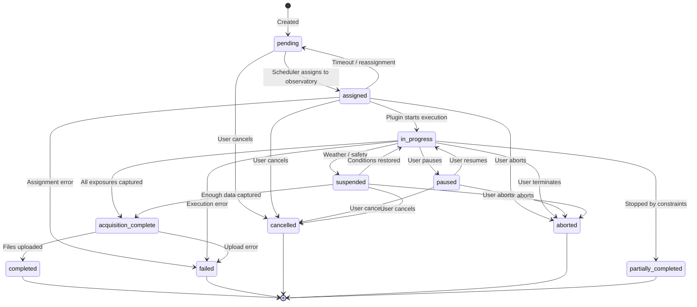

# Observation Lifecycle

**Document Version**: 1.0 | **Last Updated**: March 2026

This guide explains the complete lifecycle of an observation — every status it can be in, what triggers transitions between statuses, and what to do when things go wrong.

## State Diagram

## All Statuses Explained

### Active Statuses

| Status | Meaning |
|--------|---------|
| **Pending** | Observation is in the queue, waiting to be assigned to an observatory. The scheduler evaluates it each cycle. |
| **Assigned** | An observatory has been selected to execute this observation. The plugin has been notified and will begin when ready. |
| **In Progress** | The plugin is actively executing — slewing, centering, and capturing exposures. |
| **Acquisition Complete** | All planned exposures have been captured. The system is waiting for file uploads to finish. |
| **Paused** | Execution was temporarily paused by the user. Can be resumed. |
| **Suspended** | Execution was interrupted by weather or a safety event. Will resume automatically when conditions improve. |

### Terminal Statuses

Once an observation reaches a terminal status, it cannot transition further.

| Status | Meaning |
|--------|---------|
| **Completed** | All exposures captured and all files uploaded successfully. |
| **Failed** | An error prevented the observation from completing (equipment failure, upload error, etc.). |
| **Cancelled** | The user cancelled the observation before or during execution. |
| **Aborted** | The user (or system) terminated the observation during execution. Differs from cancelled in that some work may have been done. |
| **Partially Completed** | The observation captured some exposures but was stopped by constraints (target set below minimum altitude, time window ended, etc.). |

!!! tip "Completed vs Partially Completed"
    **Completed** means the full exposure plan finished. **Partially completed** means the observation did useful work but couldn't finish — for example, the target set below minimum altitude after 60% of exposures were captured. You can resubmit partially completed observations to capture the remaining data.

## Who Causes Transitions

Different actors in the system trigger different status changes:

| Actor | Description | Typical Transitions |
|-------|-------------|--------------------|
| **Scheduler** | The scheduling engine that assigns observations to observatories | pending → assigned |
| **Plugin** | The NINA plugin executing at the observatory | assigned → in_progress, in_progress → acquisition_complete |
| **User** | A user action through the web interface | pending → cancelled, in_progress → aborted, paused → in_progress |
| **System** | Automated monitors and background services | assigned → pending (timeout), in_progress → suspended (weather) |

## Automated Monitors

Several background services monitor observations and trigger transitions automatically:

### Plugin Heartbeat Monitor

The server expects regular heartbeat messages from connected plugins. If a plugin stops sending heartbeats (network failure, NINA crash, power loss):

- The server detects the stale connection
- Any observation assigned to that plugin may be returned to **pending** for reassignment
- The observatory is marked as potentially offline

### Stale Observation Monitor

Detects observations stuck in a status longer than expected:

| Condition | Threshold | Action |
|-----------|-----------|--------|
| Stuck in **assigned** | 48 hours | Flagged for review; may be returned to pending |
| Stuck in **in_progress** | 24 hours | Flagged for review; may be marked as failed |

### Time Limit Monitor

For time-based and fixed-time observations, the plugin monitors elapsed time and prevents starting new exposures that cannot complete before the observation window ends. When the window closes, the observation transitions to the appropriate terminal status.

### Reconciliation Service

Handles edge cases where status update messages were lost (network glitch, server restart):

- Compares expected state with actual state
- Recovers missed completion or failure messages
- Ensures the database reflects reality

## Monitoring Observations (Special Behavior)

Monitoring (cadence-based) observations have a unique lifecycle. Instead of staying in a terminal status after completion:

1. Observation completes normally → **completed**
2. System checks if the series should continue (max observations not reached, end date not passed)
3. If continuing: observation resets to **pending** with an updated `cadence_next_eligible` date
4. Scheduler waits until the next eligible date before assigning again
5. Cycle repeats until the series ends

Failed monitoring observations also reset to **pending** to allow automatic retry on the next cadence window. The failure is recorded in the series history.

## Common Questions

### "Why is my observation stuck in Pending?"

The scheduler hasn't assigned it yet. Common reasons:

- **Target not visible** — the target hasn't risen above minimum altitude at any connected observatory
- **Constraints not met** — moon too close, airmass too high, or twilight too bright
- **No observatory available** — all observatories are offline, busy, or have dispatching disabled
- **Higher priority work** — other observations are taking precedence
- **Weather** — all eligible observatories are in weather holds

**What to do**: Check the observation detail page for constraint violation information. If the target should be visible, verify your altitude and airmass constraints aren't too restrictive.

### "Why is my observation stuck in Assigned?"

The observatory was assigned the observation but hasn't started executing:

- **Plugin not running** — the NINA sequence with the Science Scheduler container may not be active
- **Observatory busy** — finishing another observation before starting yours
- **Plugin disconnected** — network issue between plugin and server

**What to do**: If stuck for more than a few hours, contact the observatory operator. The stale observation monitor will eventually return it to pending if it remains stuck for 48 hours.

### "What does Partially Completed mean?"

The observation started and captured some exposures, but stopped before completing the full plan. The detail page shows:

- How many exposures were completed vs. planned
- The completion percentage
- The reason execution stopped (e.g., "Target below minimum altitude", "Observation window ended")

**What to do**: Review the captured data — it may still be scientifically useful. Resubmit the observation if you need the remaining exposures.

### "Why was my observation Suspended?"

A weather or safety event occurred at the observatory during execution:

- **Weather hold** — unsafe conditions detected by the observatory's safety device
- **Safety event** — equipment or environmental safety trigger

Suspended observations resume automatically when safe conditions return. If conditions don't improve before the observation window closes, the observation may transition to partially completed or failed.

### "What's the difference between Cancelled and Aborted?"

- **Cancelled** — you stopped the observation before meaningful execution. No exposures were captured, or the observation hadn't started yet.
- **Aborted** — the observation was terminated during execution. Some exposures may have been captured and uploaded.

Both are terminal states, but aborted observations may have useful partial data.

### "Can I restart a failed observation?"

Failed observations cannot be directly restarted, but you can **resubmit** them. This creates a new observation with the same settings, which enters the queue as pending. See [Creating Observations — Resubmitting](CREATING_OBSERVATIONS.md#resubmitting-an-observation).

---

## Related Documentation

- **[Creating Observations](CREATING_OBSERVATIONS.md)** — How to create and manage observations
- **[Scheduler Features](SCHEDULER_FEATURES.md)** — How the scheduler assigns observations
- **[Troubleshooting](TROUBLESHOOTING.md)** — Fixing common problems
- **[Repetitive Observations](REPETITIVE_OBSERVATIONS.md)** — Recurring observation series
